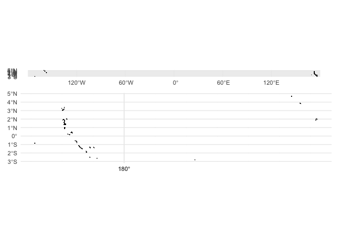
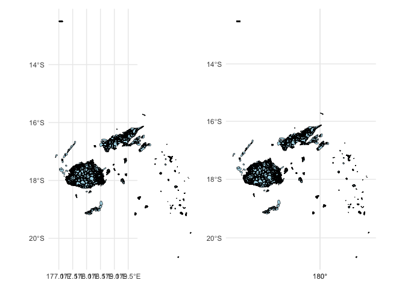

<!-- README.md is generated from README.Rmd. Please edit that file -->

# pacificmapsR

<!-- badges: start -->

<!-- badges: end -->

Quickly generating a map of a country is often an easy task. However in
the wider Pacific region there are many complications. Having a simple
package that implements best practice in storing and displaying map and
spatial data for the Pacific will lower the barrier for others to make
compelling analyses and visualisations of Pacific issues.

## Installation

You can install the development version of pacificmapsR from
[GitHub](https://github.com/) with:

``` r
# install.packages("pak")
pak::pak("JayaniLakshika/pacificmapsR")
```

## Issues mainly we addressed

``` r
library(pacificmapsR)
library(patchwork)
```

- To shift objects on the oneside of the dateline

``` r
## Problem
dd_old <- sf::st_read(here::here("data/2010_PHC_Kiribati_EnumArea_3832.geojson"), quiet = TRUE)
plot_pr1 <- plot_ejson_map(dd_old) +
  ggplot2::ggtitle("Issue")
```

``` r
## Fixed
dd <- read_ejson(here::here("data/2010_PHC_Kiribati_EnumArea_3832.geojson"))
plot_sol1 <- plot_ejson_map(dd) +
  ggplot2::ggtitle("Solution")
```

``` r
plot_pr1 + plot_sol1 +
  plot_layout(nrow = 2)
```



- Changes the coordinate reference system which solves the axis label
  problem

``` r
## Problem
dd_old <- sf::st_read(here::here("data/2007_PHC_Fiji_EnumArea_32760.geojson"), quiet = TRUE) |>
      sf::st_shift_longitude() ## To shift objects on the oneside of the dateline
  
plot_pr2 <- plot_ejson_map(dd_old) +
  ggplot2::ggtitle("Issue")  
```

``` r
## Fixed
dd <- read_ejson(here::here("data/2007_PHC_Fiji_EnumArea_32760.geojson"))
plot_sol2 <- plot_ejson_map(dd) +
  ggplot2::ggtitle("Solution")
```

``` r
plot_pr2 + plot_sol2 +
  plot_layout(ncol = 2)
```


