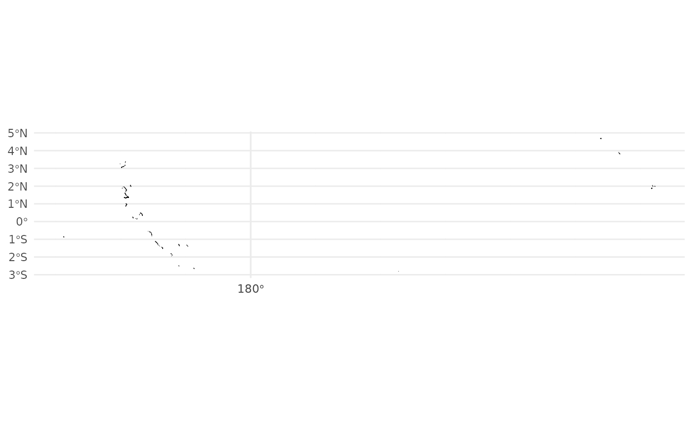
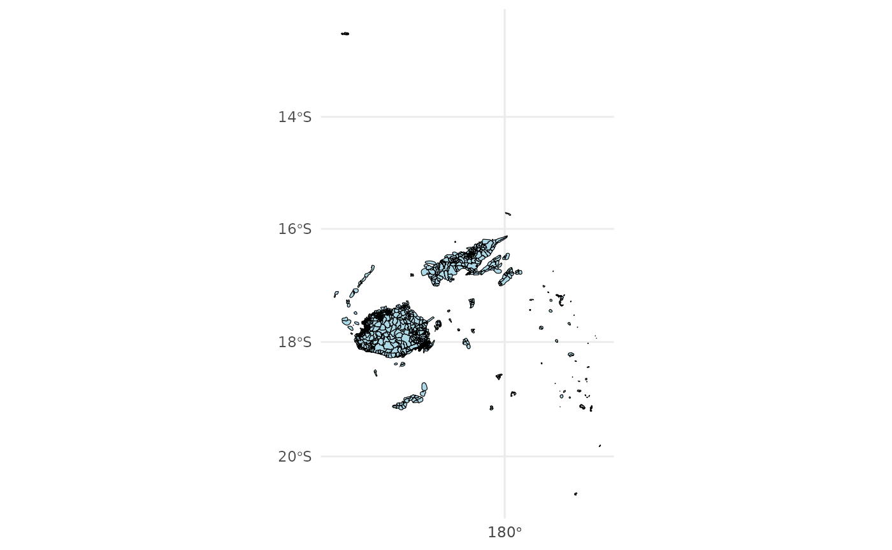

# Introduction

``` r
library(pacificmapsR)
```

``` r
dd <- read_ejson(here::here("data/2010_PHC_Kiribati_EnumArea_3832.geojson"))
```

``` r
plot_ejson_map(dd)
```



``` r
dd <- read_ejson(here::here("data/2007_PHC_Fiji_EnumArea_32760.geojson"))
```

``` r
plot_ejson_map(dd)
```


